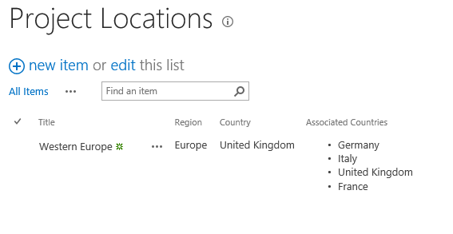
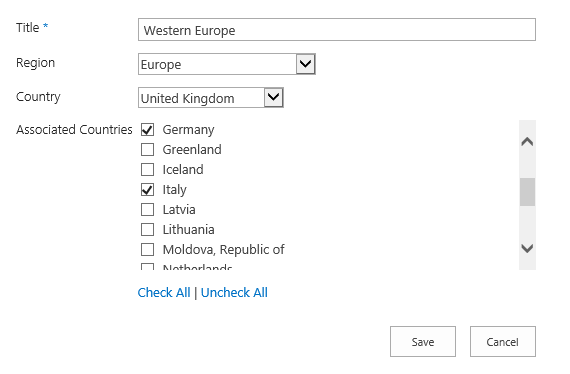
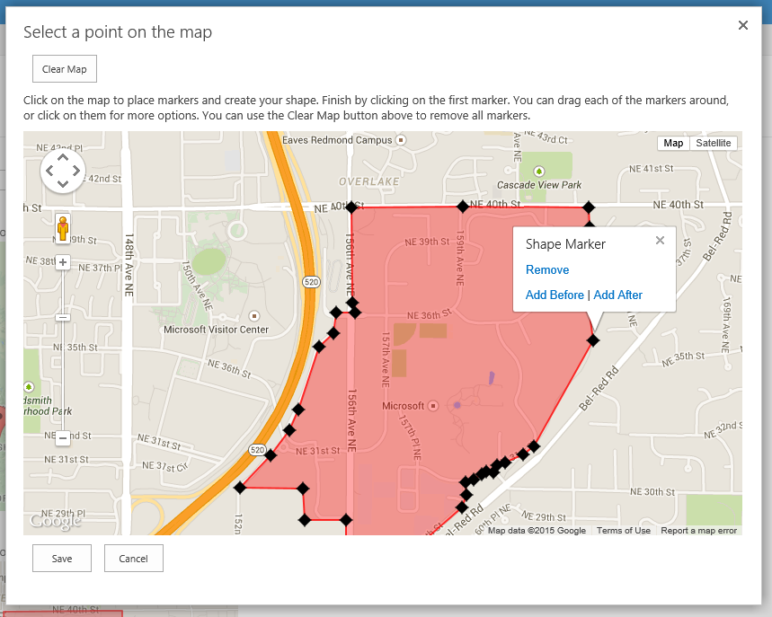
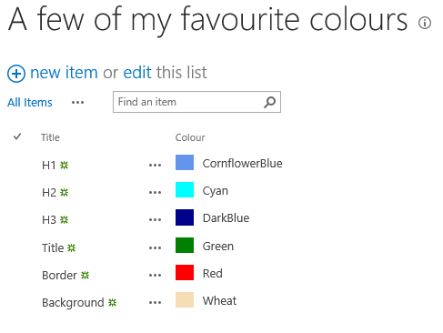
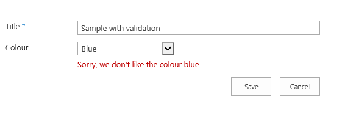

# JSLink Client Side Rendering (CSR) Samples  #

Jump To
* [Samples (including screenshots)](#jslink-samples)
* [The Re-Usable Framework](#reusable-framework)
* [Install Instructions](#install-instructions)
* [How JSLink Works](#how-jslink-works)

### Summary ###
The JSLink sample includes sample re-usable code which demonstrate how you can use the new Client Side Rendering techniques along with JSLink hooks to modify the rendering of List Forms and Views.

The download includes a Visual Studio 2013 solution which compiles to a SharePoint 2013 WSP Package. this includes both a set of sample re-usable frameworks for JSLink display templates, as well as various lists which demo the functionality.

Specifically functionality includes

* Rendering a single-select Taxonomy field as cascading drop-downs
* Rendering two related lookup fields as cascading Drop-Downs (single-select) or checkboxes (multi-select)
* Presenting a Google Maps interface for selecting points or areas on a map
* Sample Colour Picker with formatted display, custom editing (as drop-downs) and a sample validators

*More detail on these samples are included [below](#jslink-samples)*

### Applies to ###
-  SharePoint Online (All SKUs)
-  SharePoint Server 2013 (Standard and Enterprise)

### Prerequisites ###
None

### Solution ###
Solution | Author(s)
---------|----------
Branding.JSLink | Martin Hatch *(@martinhatch)*

### Version history ###
Version  | Date | Comments
---------| -----| --------
1.0  | April 22nd 2015 | Initial release

### Disclaimer ###
**THIS CODE IS PROVIDED *AS IS* WITHOUT WARRANTY OF ANY KIND, EITHER EXPRESS OR IMPLIED, INCLUDING ANY IMPLIED WARRANTIES OF FITNESS FOR A PARTICULAR PURPOSE, MERCHANTABILITY, OR NON-INFRINGEMENT.**

----------

# JSLink Samples #
This section describes each of the samples in more detail.

## Taxonomy Field - Cascading Dropdowns ##
This currently consists of a reusable library which allows you to convert a single-select Taxonomy (Managed Metadata) field and it renders it as a set of cascading drop-downs.

The drop-down values will automatically populate based on the hierarchy of the termset that the field is bound to. 

You can see below the field in action using a "Microsoft Products" term set (which is included in the source code of the sample)

## Related Lookup Fields - Cascading Dropdowns and Checkboxes ##
This sample consists of a reusable library where you can change the rendering of lookup fields.

I allows you to change how the views render (removing the clickable links on lookup fields, and changing the multi-select lookups to a list (instead of a ";" delimited block of text)

The editing interface allows you to perform cascading drop-downs (some limitations apply, see the [reusable framework(#reusable-framework) section below) and you can change a multi-select lookup to render as checkboxes.

## Google Maps fields ##
These can be applied to any text fields (for points) or multi-line text fields (for area selection).

This will automatically render thumbnail images in list views...

.. an inline editing experience showing a larger thumbnail ..

.. and dialogs allowing the editing to take place ..

## Colour Picker ##
This is a simple colour picker scenario with all of the HTML colours rendering in a drop-down list, with the actual colour being shown in the View and Display Form. 

..

This also includes an example of a "Validator" where you can control validation of data entry through the SharePoint CSR techniques

# Reusable Framework #

# Install Instructions #

The source solution is a SharePoint 2013 WSP No-Code-Sandbox-Solution (NCSS) which can be deployed to the Solution Gallery in either SharePoint on-prem, SharePoint online or any other cloud hosted SharePoint 2013 environment. Where practically possible the solution includes pre-provisioned SharePoint lists which demonstrate the sample functionality included in this release.  

# How JSLink Works #
